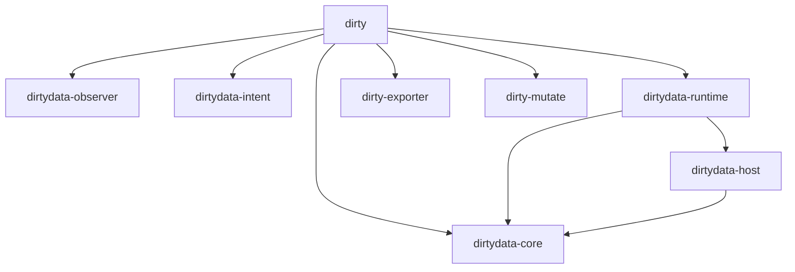

# DirtyData Architecture

This is a technical reference regarding the internal structure (Architecture) of DirtyData.
The system is divided into multiple crates (layers), each with strict roles and boundaries.

## 1. DirtyData Core Engine

Defined in the `dirtydata-core` crate, this is the system's single Source of Truth.

- **`Graph`**: Holds the structure of the entire project. It contains all `Nodes`, `Edges`, `Modulations`, and the history of applied `PatchIds`.
- **`Node`**: Components such as audio sources (`Source`), effects (`Processor`), external plugins (`Foreign`), and **modularized circuits (`CircuitModule`)**.
- **`Edge`**: Connections (routing) between nodes. In addition to normal connections, feedback connections (1-sample delay) are explicitly distinguished.
- **`Modulation`**: "Cable-less" modulation assignments to node parameters (Bitwig style).
- **`ConfigSnapshot`**: Node parameters. `BTreeMap` is used to guarantee deterministic ordering.

It is **forbidden** for the GUI or users to directly rewrite the IR. All state changes must be applied through a `Patch`.

DirtyData features a branch management system inspired by Git.

- Enables ultra-fast "moving between parallel worlds" by simply switching IR pointers (HEAD and refs) without duplicating physical audio or session files.
- `Storage` manages `.dirtydata/refs/heads/` and `.dirtydata/HEAD`, tracking which `PatchId` ancestry each branch belongs to.

Wraps the DirtyData core into a DAW-compatible plugin via the `nih-plug` framework.

The `dirtydata-runtime` crate converts the IR graph into an actual "audible state".

- **`cpal`**: Communicates directly with the OS audio device and starts a real-time callback thread.
- **`arc-swap`**: Implements lock-free double buffering. When a user adds a new effect via `dirty patch apply`, it atomically switches to the new DSP graph pointer safely without ever blocking the audio callback (zero glitches).

## 4. Circuit Module & Mutation History

DirtyData records the evolution of nodes as a "Circuit", not just a list of DSP nodes.

- **`CircuitModule`**: A "predefined circuit" combining multiple basic nodes. It possesses DNA registered in the `CircuitRegistry`.
- **`MutationHistory`**: Records the history of how a circuit has evolved (Mutated).
    - **Tier 1: Safe**: Minute drifts in parameters.
    - **Tier 2: Wild**: Swapping of components.
    - **Tier 3: Radioactive**: Changes to the circuit topology itself.
    - **Tier 4: Forbidden**: Evolution beyond the stability boundary.

## 5. Plugin Sandbox (IPC Boundary)

`dirtydata-host` protects the core system from unstable third-party plugins like VSTs.

- Plugins run as **independent child processes** called `dirtydata-plugin-worker`.
- Audio buffers are passed via RPC communication over `stdin` / `stdout`.
- The sandbox instantly detects if a child process returns `NaN` (NaN Storm) or crashes (Segfault), and safely **falls back to a Frozen Asset (currently a silent buffer)**.

## 6. Observer Daemon

The `dirtydata-observer` and the CLI `daemon` subcommand monitor discrepancies between the system and the "external world" (file system, etc.).

- **Observe before Control**: Recalculates BLAKE3 hashes and timestamps of external audio files (WAV, etc.) before changing the system state.
- **Hot-Reloading**: Real-time detection of changes to `.dirtydata/ir/current.json` using the `notify` crate, automatically updating the audio engine graph.
- If an external file is manually modified, it is immediately detected, and the Confidence Score is dropped to `Suspicious` with a warning.

## 8. The VoiceStack (Polyphony)

DirtyData transcends monophonic limitations to achieve dynamic polyphony.
Internally implemented as replicas of `SubGraph` nodes, where commands (NoteOn/Off) are distributed to specific instances by a voice allocator.

## 9. The Conductor (Sequencer & CV-Command)

DirtyData's sequencer employs the **CV-Command Protocol**, embedding commands directly within the audio signal.

- **Left Channel**: Command code (NoteOn/Off, etc.).
- **Right Channel**: Payload (Note number, velocity, etc.).
Since these are treated as audio signals, "performance information itself" can be modulated and processed by DSP nodes like Delays or LFOs.

## 10. State Preservation (Inception-style Hot-swapping)

Prevents oscillator phases or envelope states from resetting during graph hot-swaps.

- **`extract_state()` / `inject_state()`**: For nodes with matching `StableId` between old and new graphs, internal dynamic states are extracted and injected into the new instance. This maintains audio continuity (Zero-Glitch) while rewriting node configurations during performance.

## 11. Domain Isolation (Reality vs. Observation)

To maintain forensic determinism, DirtyData strictly separates the system into two domains: "Reality" and "Observation."

- **🟥 Rust: Layer of Reality (Execution Layer)**
    - Role: Controls all "Sound Generation" and "Fact Recording."
    - Components: DSP Graph, JIT, Merkle DAG, MNA Solver, CAS (Content Addressable Storage).
    - Responsibility: Ensuring 100% reproducibility and deterministic integrity.
- **🟦 Python: Layer of Observation (Analysis Layer)**
    - Role: Used to "Understand" and "Learn" from the data obtained from reality.
    - Components: Data Fetching (NumPy), ML Integration (PyTorch/TF), Waveform Analysis, Plotting.
    - Responsibility: Exploratory audio research and ML model training.

### 🟨 The Forbidden Region
To prevent forensic decay, the following operations are **strictly forbidden** from the Python domain:
1.  **Direct Graph Mutation**: Any change must be issued as a Patch via the Rust SDK to maintain lineage integrity.
2.  **Real-time DSP Execution**: Audio output must always occur in the Rust domain to avoid determinism failure due to GIL or timing jitter.
3.  **Core Solver Re-implementation**: MNA or other logic must not be independently implemented in Python; the Rust core must be called to prevent mathematical divergence.

## Crate Dependencies

