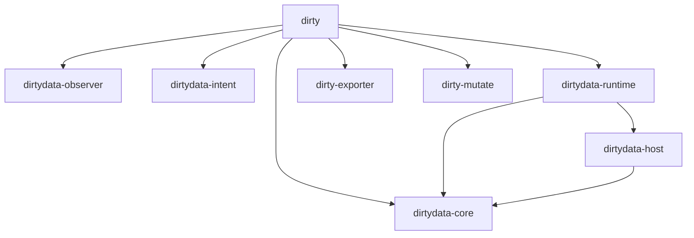

# DirtyData Architecture

DirtyData の内部構造（Architecture）に関する技術的リファレンスです。
システムは複数のクレート（層）に分割され、それぞれが厳格な役割と境界を持っています。

## 1. Canonical IR (Machine Truth)

`dirtydata-core` クレートで定義されている、システムの唯一の真実（Source of Truth）です。

- **`Graph`**: プロジェクト全体の構造を保持します。すべての `Node` と `Edge`、`Modulation`、そして適用された `PatchId` の履歴を持ちます。
- **`Node`**: オーディオソース（`Source`）、エフェクト（`Processor`）、外部プラグイン（`Foreign`）、そして**モジュール化された回路（`CircuitModule`）**などの構成要素です。
- **`Edge`**: ノード間の接続（ルーティング）です。通常接続に加え、フィードバック接続（1サンプル遅延）を明示的に区別します。
- **`Modulation`**: ノードのパラメーターに対する「ケーブルレス」な変調アサインメントです（Bitwig スタイル）。
- **`ConfigSnapshot`**: ノードのパラメーター。決定論的な順序を保証するため `BTreeMap` が使用されています。

GUI やユーザーが IR を直接書き換えることは**禁止**されています。すべての状態変化は `Patch` を通じて適用されなければなりません。

## 2. Timeline / Branching System

DirtyData は、Git にインスパイアされたブランチ管理システムを持っています。

- 物理的なオーディオファイルやセッションファイルを複製することなく、IR のポインタ（HEAD と refs）のみを切り替えることで超高速な「パラレルワールドの移動」を実現します。
- `Storage` は `.dirtydata/refs/heads/` と `.dirtydata/HEAD` を管理し、各ブランチがどの `PatchId` の系統（Ancestry）に属しているかを追跡します。

## 3. Playable Runtime (cpal + arc-swap)

`dirtydata-runtime` クレートは、IR グラフを実際に「音の出る状態」へ変換します。

- **`cpal`**: OS のオーディオデバイスと直接通信し、リアルタイムのコールバックスレッドを起動します。
- **`arc-swap`**: ロックフリーের ダブルバッファリングを実現します。ユーザーが `dirtydata patch apply` で新しいエフェクトを追加した際、オーディオコールバックを一度もブロックすることなく（= 音切れなしに）、安全に新しい DSP グラフのポインタへアトミックに切り替えます。

## 4. Circuit Module & Mutation History

DirtyData は、単なる DSP ノードの羅列ではなく、回路（Circuit）としての進化を記録します。

- **`CircuitModule`**: 複数の基本ノードを組み合わせた「定義済み回路」です。`CircuitRegistry` に登録された DNA を持ちます。
- **`MutationHistory`**: 回路がどのように進化（Mutate）してきたかの来歴を記録します。
    - **Tier 1: Safe**: パラメーターの微細なドリフト。
    - **Tier 2: Wild**: コンポーネントの入れ替え。
    - **Tier 3: Radioactive**: 回路トポロジー自体の変更。
    - **Tier 4: Forbidden**: 安定境界を越えた進化。

## 5. Plugin Sandbox (IPC Boundary)

`dirtydata-host` は、VST などの不安定なサードパーティ製プラグインからコアシステムを保護します。

- プラグインは `dirtydata-plugin-worker` という**独立した子プロセス**として起動します。
- `stdin` / `stdout` 越しの RPC 通信によってオーディオバッファの受け渡しを行います。
- サンドボックスは、子プロセスが `NaN` を返した（NaN Storm）り、プロセスがクラッシュ（Segfault）したことを瞬時に検知し、出力を安全な **Frozen Asset（現在は無音のバッファ）へフォールバック** させます。

## 6. Observer Daemon

`dirtydata-observer` および CLI の `daemon` サブコマンドは、システムと「外部世界（ファイルシステムなど）」とのズレを監視します。

- **Observe before Control**: システムの状態を変更する前に、外部オーディオファイル（WAV 等）の BLAKE3 ハッシュやタイムスタンプを再計算します。
- **Hot-Reloading**: `.dirtydata/ir/current.json` の変更を `notify` クレートでリアルタイムに検知し、オーディオエンジンのグラフを自動更新します。
- 外部ファイルが手動で書き換えられた場合、即座にそれを検知し、Confidence Score（信頼性スコア）を `Suspicious` に落として警告を出します。

## 8. The VoiceStack (Polyphony)

DirtyData は、単音（モノフォニック）の制限を超え、動的なポリフォニーを実現します。
内部的には `SubGraph` ノードの複製として実装され、ボイス・アロケーターによって特定のインスタンスへコマンド（NoteOn/Off）が振り分けられます。

## 9. The Conductor (Sequencer & CV-Command)

DirtyData のシーケンサーは、オーディオ信号の中にコマンドを埋め込む **CV-Command Protocol** を採用しています。

- **Left Channel**: コマンドコード（NoteOn/Off 等）。
- **Right Channel**: ペイロード（ノート番号、ベロシティ等）。
これらはオーディオ信号として扱われるため、Delay や LFO などの DSP ノードで「演奏情報そのもの」を変調・加工することが可能です。

## 10. State Preservation (Inception-style Hot-swapping)

グラフのホットスワップ時、オシレーターの位相やエンベロープの状態がリセットされることを防ぎます。

- **`extract_state()` / `inject_state()`**: 新旧のグラフ間で `StableId` が一致するノードに対し、内部の動的な状態を抽出し、新しいインスタンスへ注入します。これにより、演奏中であっても音の連続性を保ったまま（Zero-Glitch）ノード構成を書き換えることが可能です。

## 11. Domain Isolation (Reality vs. Observation)

DirtyData は、フォレンジックな決定論を維持するため、システムを「現実（Reality）」と「観測（Observation）」の2つのドメインに厳格に分離します。

- **🟥 Rust: 現実の階層（Execution Layer）**
    - 役割: すべての「音の生成」と「事実の記録」を司ります。
    - 構成: DSPグラフ、JIT、Merkle DAG、MNAソルバー、CAS（Content Addressable Storage）。
    - 責務: 100%の再現性と決定論的な正当性の担保。
- **🟦 Python: 観測の階層（Analysis Layer）**
    - 役割: 現実から得られたデータを「理解」し、「学習」するために利用します。
    - 構成: データ取得（NumPy）、ML連携（PyTorch/TF）、波形分析、プロット表示。
    - 責務: 研究者やエンジニアによる音響探索と、MLモデルの訓練。

### 🟨 禁止領域 (The Forbidden Region)
システムの崩壊（フォレンジック・ディケイ）を防ぐため、Pythonドメインからの以下の操作は**厳禁**とされています。
1.  **グラフ構造の直接変更**: 履歴の整合性が壊れるため、変更は必ずRustのSDK経由でパッチとして発行します。
2.  **リアルタイムDSP実行**: GILや実行速度の変動による決定論の破壊を防ぐため、音声出力は常にRustドメインで行います。
3.  **コア・ソルバーの再実装**: 数学的な乖離を防ぐため、MNA等のロジックはPython側で独自に実装せず、Rustのコアを呼び出します。

## クレートの依存関係

